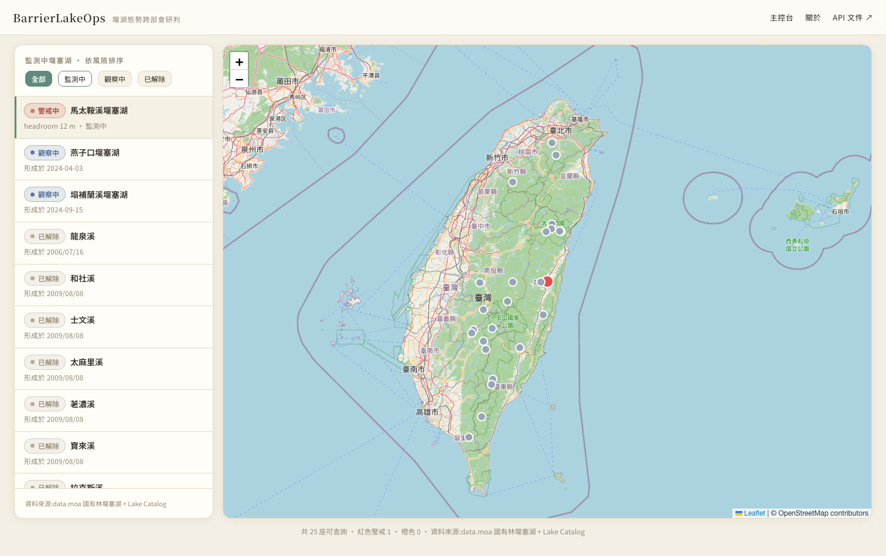
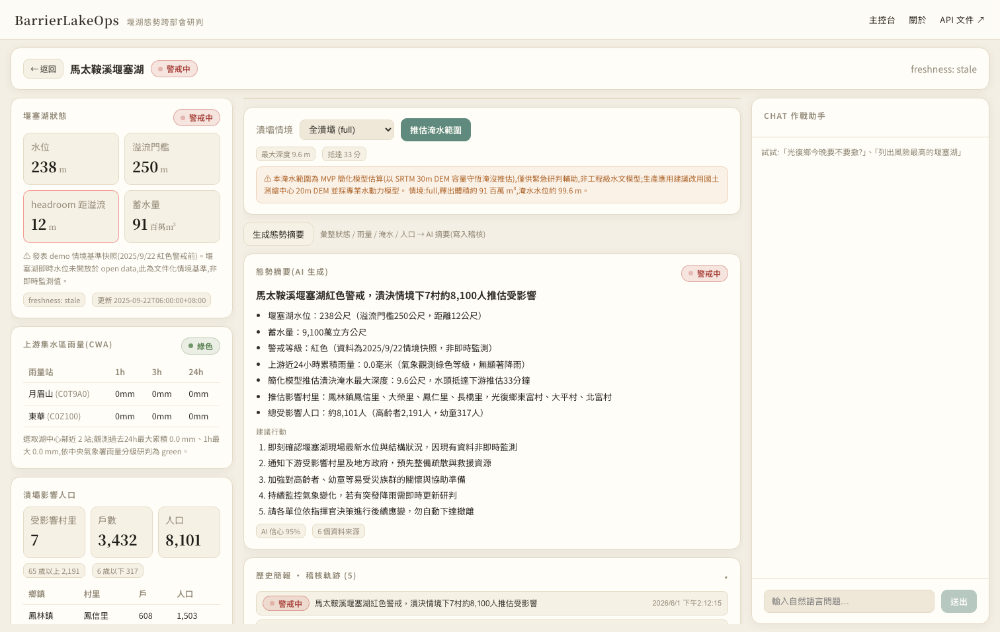
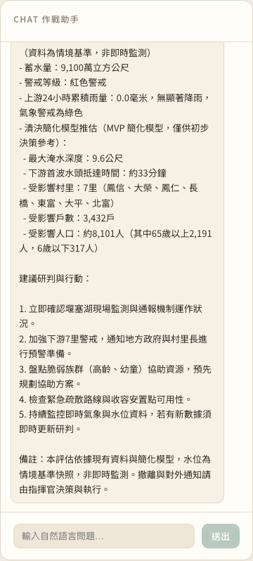
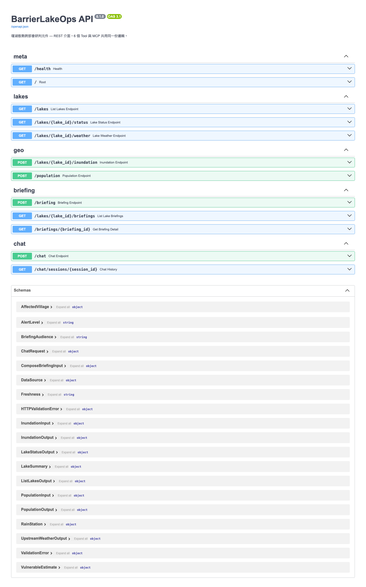

# BarrierLakeOps｜堰湖態勢跨部會研判元件

> **把分散在六個部會的堰塞湖資料,封裝成 AI 能一次調用的積木。**
> 2026 數位發展部「防災積木元件創新賽:公民科技拼出韌性臺灣」參賽作品
> 參賽隊伍:**扣握貝果(CodeWorldBagel)**｜元件型態:**MCP 伺服器型 × API 服務型(雙介面)**｜競賽軌道:**分析(Analysis)**

| | 連結 |
|---|---|
| 🌐 線上 Demo(Web 儀表板) | **https://barrierlakeops.codeworldbagel.com** |
| 📜 REST API 文件(Swagger) | **https://barrierlakeops-api.codeworldbagel.com/docs** |
| 💻 原始碼(GitHub) | **https://github.com/CodeWorldBagel/BarrierLakeOps** |

---

## 目錄

1. [緣起:距離潰壩,只剩兩天](#一緣起距離潰壩只剩兩天)
2. [解法:把跨部會盤點,交給機器](#二解法把跨部會盤點交給機器)
3. [六塊積木:元件設計](#三六塊積木元件設計)
4. [讓畫面說故事:實際運作](#四讓畫面說故事實際運作)
5. [AI 的角色與界線](#五ai-的角色與界線)
6. [預期效益](#六預期效益)
7. [延伸可能](#七延伸可能)
8. [怎麼接上你的系統:可拼接性](#八怎麼接上你的系統可拼接性)
9. [附錄](#附錄)

---

## 一、緣起:距離潰壩,只剩兩天

> 對應評分項目「**問題貼近度與真實性**」(20 分)

2025 年 9 月 23 日,花蓮馬太鞍溪堰塞湖溢流潰壩。**19 人死亡、5 人失聯、157 人受傷、1,837 戶受影響。**

事後檢討揭露了一個讓人不安的事實:這場災害真正失靈的,不只是那道天然壩體,還有**資訊**。當時的關鍵資料,分散在至少六套彼此不相通的系統裡——

- 堰塞湖蓄水位,在林業及自然保育署的監測端;
- 上游集水區的雨量,在中央氣象署;
- 下游的淹水預測,在水利署;
- 撤離名冊,在花蓮縣府的 EMIC。

**沒有任何一個畫面,能讓人一次看完全貌。** 台大團隊重新模擬後,把疏散範圍從約 700 人一路擴大到 1,800 戶——而這個修正,距離災害真正發生,只剩下大約兩天。

### 人物角色:夜班裡的王大明

> **王大明,42 歲,花蓮縣府災害應變中心輪值人員。**
>
> 颱風夜,他在中心同時盯著好幾套系統:CWA 的雨量、水利署的水位、堰塞湖蓄水監測、農村署的土石流警戒、縣府自家的災情系統。每一套登入方式不同、欄位長得不一樣,他得靠 LINE 群組一句一句請各局處的同仁幫忙回報數字,才能把全貌「拼」出來。當紅色警戒發布、指揮官在限時內要他回答「**潰壩會淹到哪些村里、影響多少人**」時,這種用人腦串接的工作方式,在夜班的疲憊裡,極容易漏接掉一個關鍵數字。

### 痛點不只一次,而且會一直重演

現行作法的斷點很具體:

1. **資料看不齊**——相關資訊散落在六個以上的系統。
2. **格式不一致**——各機關欄位填法不同,部分來源甚至只有網頁地圖、沒有可程式讀取的介面。
3. **人力依賴**——跨系統盤點仰賴人腦,疲勞時最容易出錯。
4. **AI 接不上**——不論政府的 TAIDE 或民間的 Claude / GPT,目前都**無法直接呼叫**這些系統,因此難以替應變中心提供決策輔助。
5. **無法重複使用**——每出現一個新堰塞湖,就要從頭再做一次工具整合。

而馬太鞍**不是孤例**。2024 年花蓮強震後,中央山脈大範圍山體鬆動,陸續形成多處堰塞湖;農業部林業及自然保育署目前已開放 **25 筆「國有林堰塞湖」**資訊。每多一個新堰塞湖,王大明們就要把上面那套折磨,重新走一遍。

**我們想解的,就是這件一再重演的事。**

---

## 二、解法:把跨部會盤點,交給機器

> 本作品定位於競賽簡章第二點的「**分析(Analysis)**」軌道:將可取得的公開資訊整理與分析,辨識高風險區域、急需支援事項與告警事件,以數據支援指揮判斷與資源調度。

BarrierLakeOps 是一個遵循 **Model Context Protocol(MCP)** 標準的工具伺服器,把「堰塞湖態勢研判」所需的跨部會資料,封裝成**可被 AI Agent 多步驟調用的標準工具集**。

我們的設計理念有四條:

1. **不重新發明資料**——而是把分散的官方開放資料,以一致的介面對外暴露。
2. **不取代人類決策**——而是把「資料盤點」這件機械、易錯、耗神的工作交給機器。
3. **不綁定單一事件**——以 Lake Catalog 設定檔驅動,新增一座堰塞湖只要加一筆設定。
4. **不綁定單一介面**——以 MCP 與 HTTP REST 雙介面交付,讓 AI 助理、Web App、CLI 都能消費同一份邏輯。

> **為什麼是 MCP?**
> 把 MCP 想成「**AI 助理的 USB-C**」——任何支援 MCP 的 AI Agent(Claude Desktop、Cursor、未來的政府智慧助手)都能直接掛上 BarrierLakeOps,用自然語言一問,就取得跨部會態勢資料,不必各自重寫一遍整合程式碼。

---

## 三、六塊積木:元件設計

> 對應評分項目「**可行性與完成度**」(30 分)、「**元件化與可拼接性**」(30 分)

本元件採「積木式設計」精神,由 **6 個獨立 Tool** 組成。每一塊積木都有明確的 **Input / Function / Output**,可以單獨呼叫,也能被 AI Agent 串接成多步驟流程。

### 3.1 六個 Tool 規格

| # | Tool | 主要輸入 | 功能 | 主要輸出 | 真實資料源 |
|---|---|---|---|---|---|
| 0 | `list_lakes` | `status_filter` | 列出可查詢堰塞湖,依風險排序 | 湖清單 + `data_sources[]` | data.moa 國有林堰塞湖 + Lake Catalog |
| 1 | `get_lake_status` | `lake_id` | 取得水位、蓄水量、距溢流 headroom、警戒等級 | 狀態物件 | data.moa(+ 情境基準快照) |
| 2 | `get_upstream_weather` | `lake_id` | 上游集水區鄰近雨量站觀測與警戒 | 雨量站 + 警戒 + 研判理由 | CWA O-A0002 即時觀測 |
| 3 | `estimate_inundation` | `lake_id`, `breach_scenario` | 潰壩淹水範圍推估 | **GeoJSON** polygon + 深度 + 抵達時間 | NASA SRTM 30m DEM(內建) |
| 4 | `get_affected_population` | `polygon`(GeoJSON) | 淹水範圍內村里、戶數、人口與弱勢 | 受影響村里 + 老幼統計 | 內政部村里界 + 單一年齡人口 |
| 5 | `compose_briefing` | Tool 0–4 回傳, `audience` | 生成結構化態勢摘要 | 摘要 + `ai_confidence` + 來源清單 | OpenAI(消化前述工具輸出) |

每個 Tool 的輸出都帶有 `data_sources` 欄位,逐項標註**來源、授權條款與 attribution**,確保下游使用可追溯、可合規再散布。

### 3.2 標準化的輸入與輸出

- I/O 以 **Pydantic / JSON Schema** 嚴格定義;
- 地理資料採 **GeoJSON**、時間採 **RFC 3339**;
- 完整 OpenAPI(Swagger)規格公開於 [`/docs`](https://barrierlakeops-api.codeworldbagel.com/docs)。

以 Tool 3 的輸出為例(節錄):

```json
{
  "lake_id": "mataian-2025",
  "inundation_polygon": { "type": "Feature", "geometry": { "type": "MultiPolygon", "coordinates": [...] } },
  "max_depth_m_estimate": 9.6,
  "leading_edge_arrival_minutes": 33,
  "model_used": "BarrierLakeOps MVP bathtub-fill v0.1 (SRTM 30m, 容量守恆 + 連通域)",
  "disclaimer": "本淹水範圍為 MVP 簡化模型估算,僅供緊急研判輔助,非工程級水文模型……",
  "data_sources": [ { "source": "SRTM 30m 數值高程(NASA,公有領域)", "license": "Public Domain" } ]
}
```

### 3.3 關鍵設計:Lake Catalog + Adapter 介面

**Lake Catalog(YAML)** 描述每座堰塞湖的 id、座標、流域、警戒值、對應的上游雨量站、下游 DEM 範圍。**新增一座堰塞湖,只需要加一筆設定,不必修改任何一行程式碼。**

**Adapter 介面**讓資料源層可以隨時擴展:每個資料源是一個獨立 adapter(data.moa、CWA、SRTM DEM、村里人口……),任一外部來源失效時,回傳明確錯誤狀態,而**不是捏造一個數字填補**。

### 3.4 系統架構

```
        AI Agent (MCP)                Web 前端 (REST + SSE)
   Claude Desktop / Cursor          Nuxt 3 Reference Client
            │                                  │
            └───────────────┬──────────────────┘
                            ▼
        ┌──────────────────────────────────────────┐
        │   BarrierLakeOps(FastMCP + FastAPI)       │
        │   6 Tools 共用同一份 Pydantic schema 與邏輯  │
        └───────┬──────────────────────────┬────────┘
                │ adapters                  │ Postgres
       data.moa │ CWA │ SRTM DEM │ 村里人口   │ briefings 稽核 + chat 歷史
                ▼                           ▼
            (政府開放資料)            (持久化、可追溯)
```

> 同一份 Tool 邏輯,以 **MCP**(對應簡章 §7(三)6 MCP 伺服器型)與 **HTTP REST**(對應 §7(三)2 API 服務型)兩種介面同時暴露,確保行為一致——不會出現「MCP 修了、REST 沒修」的不對稱。

---

## 四、讓畫面說故事:實際運作

> 對應「可行性與完成度」之 **MVP / Functional Prototype** 要求——本作品已可實際操作,串接真實政府開放資料。

本元件附帶一個 **Nuxt 3 Reference Client**,示範未掛載 MCP 的單位(例如不便部署 Claude Desktop 的縣府人員)如何透過瀏覽器,直接消費同一組 6 個 Tool。

### 4.1 主控台:全台堰塞湖,一眼看完

落地第一個畫面,就是王大明最需要的那張「全貌」:左側是依風險排序的堰塞湖清單(紅色警戒置頂),中央是全台地圖,每座湖以警戒色標記。



目前系統可查詢 **25 座**堰塞湖。其中只有馬太鞍溪具備即時態勢(紅色警戒、headroom 12 公尺),其餘多為已解除或觀察中——清單以**不同顏色的狀態徽章**(警戒中 / 觀察中 / 已解除)清楚區分,沒有真實水位資料的湖泊,**誠實標示而非杜撰警戒**。

### 4.2 作戰室:單一堰塞湖的深入研判

點進任一座湖,就是「作戰室」——對應情境 B 的完整跨部會盤點。左欄是即時狀態(水位、溢流門檻、headroom、上游雨量、影響人口);中央是地圖與**潰壩淹水範圍**、AI 態勢摘要與歷史簡報;右欄是 Chat 作戰助手。



以馬太鞍的全潰壩情境為例,系統以**真實 SRTM 高程**跑簡化淹沒模型,推估出:**最大淹水深度約 9.6 公尺、洪峰約 33 分鐘抵達下游**,並以 shapely 與真實**村里界**相交,算出受影響範圍涵蓋光復鄉與鳳林鎮共 **7 個村里、3,432 戶、8,101 人**,其中 **65 歲以上 2,191 人、6 歲以下 317 人**。每一個數字,都標註了它的來源與「這是 MVP 簡化模型」的免責說明。

### 4.3 Chat 作戰助手:用一句話,完成一次盤點

最能體現「AI 自主多步調用」的,是右側的 Chat。使用者只要輸入一句自然語言——例如「**光復鄉今晚要不要撤離?**」——後端的 LLM Agent 就會自主規劃、依序調用 6 個 Tool,並以 SSE 即時把「呼叫了哪個工具、拿到什麼結果」攤在眼前,最後彙整成一份給指揮官看的態勢摘要。



注意它的結尾:**它只提供研判與建議,並明確把撤離決策交還給人類指揮官**,也清楚標示水位為情境基準、非即時監測——這是我們刻意劃下的 AI 界線(詳見第五節)。

### 4.4 開發者視角:OpenAPI 文件

對想以標準 HTTP 方式整合的系統,所有端點都自動產生 Swagger 文件,輸入輸出 schema 一覽無遺。



### 4.5 兩個典型情境的走查

**情境 A — 全台堰塞湖風險概覽(展現可重複使用性)**
```
list_lakes(status_filter="active") → 逐湖 get_lake_status → compose_briefing(multi_lake_overview)
```

**情境 B — 單一堰塞湖深入分析(以馬太鞍為主案例)**
```
get_lake_status → get_upstream_weather
   → (條件式)若 headroom 偏低且預報雨量偏高
       → estimate_inundation → get_affected_population
   → compose_briefing(command_center)
```

---

## 五、AI 的角色與界線

> 對應評分項目「**AI 加分項**」(10 分)

我們認為,真正的 AI 公共價值,不是把 LLM 塞進每一個應用,而是**把既有的政府開放資料,標準化為 AI Agent 可調用的元件**,讓 AI 能在防災情境裡,扮演稱職的「跨部會盤點助手」。

AI 在本作品中,以三種方式出現:

1. **外部 Agent 作為「使用者」**——元件以 MCP 標準對外暴露 6 個 Tool,接收 Claude / GPT / 國產 TAIDE 等 Agent 的多步驟調用請求,由 Agent 自主規劃調用順序、處理工具間的資料依賴。
2. **內建 LLM 於 Tool 5**——`compose_briefing` 在內部使用 LLM,把 Tool 0–4 的原始資料,依受眾(指揮官 / 民眾 / 媒體 / 多湖概覽)轉寫為態勢摘要。
3. **Reference Client 內建 Agent**——Web 端 Chat 後端封裝一個 LLM Agent,在受限的 system prompt 下,僅調用本元件的 6 個 Tool。其完整設計(角色、system prompt、多步調用策略、工具守則、拒答與降級規則)公開於 [`backend/src/barrier_lake_ops/agent/AGENT.md`](backend/src/barrier_lake_ops/agent/AGENT.md),確保 AI 應用可被審查與重現。

### 我們刻意不做的事(AI 應用界線)

> 對應簡章對「潛在風險、使用界線與基本治理原則(透明性、可靠性、避免誤用)」的要求。

- **不自動下達撤離指令、不直接觸發警報**——決策權保留給人類指揮官。
- **不串接 PWS / LINE / Email 等實際發送通道**——即使使用者在 Chat 輸入「請發撤離簡訊」,元件也只產出建議內容,對外通知仍由人類執行。
- **不接收外部社群媒體文本作為輸入**——避免成為假訊息放大器。
- **模型限制透明化**——Tool 3 為 MVP 簡化模型,輸出明確標註 `model_used` 與 `disclaimer`。
- **LLM 輸出可追溯**——Tool 5 含 `ai_confidence` 與 `data_sources_used` 完整清單,可逐項回查。
- **失效降級不杜撰**——外部 API 不可用時,回傳明確錯誤狀態(stale / unavailable),Agent 在最終回應如實告知缺漏。
- **隱私邊界**——人口資料以村里為最小粒度,不揭露個人資訊。

---

## 六、預期效益

- **降低跨部會盤點負擔**——應變人員不必切換多套系統、手動拼湊資料。
- **提供可追溯的研判依據**——每筆摘要含 `data_sources`,並寫入 Postgres 稽核(連同驅動它的輸入快照),可逐項回查。
- **建立可重複使用的防災基礎建設**——不為單一事件而做;新堰塞湖出現,只需在 Catalog 加一筆設定。
- **降低 AI 接入防災資料的門檻**——任何支援 MCP 的 Agent 都能直接使用,不必各自重寫整合程式碼。
- **完整資料授權合規**——所有輸出揭露來源與授權,確保下游可開源、可商用、可衍生。

---

## 七、延伸可能

- **延伸至其他資料源**——Adapter 介面預留 NCDR Datahub 接點,可擴展至非國有林堰塞湖。
- **延伸至其他災害類型**——同一架構(Catalog + Adapter + Tool)可推廣到土石流潛勢溪流、淹水潛勢區、土砂災害。
- **替換 Tool 3 為專業水文模型**——目前為 MVP 簡化模型(SRTM 30m),介面已標準化,未來可無痛替換為國土測繪中心 20m DEM 與水保局 / 學術等級之專業模型。
- **整合 PWS 細胞廣播**——在指揮官確認後,觸發官方 PWS 推播(本元件不自動執行,僅提供決策輔助)。
- **多語化輸出**——Tool 5 摘要可擴展為英文、印尼文、越南文,協助外籍移工取得即時撤離資訊。

---

## 八、怎麼接上你的系統:可拼接性

> 對應評分項目「**元件化與可拼接性**」(30 分):本元件不綁定任何前端、AI 模型、單一機關系統或單一堰塞湖。

提供六種接法:

1. **標準 MCP 介面**——任何支援 MCP 的 Agent 皆可掛載。

   ```json
   // claude_desktop_config.json
   {
     "mcpServers": {
       "barrier-lake-ops": {
         "command": "uv",
         "args": ["run", "barrier-lake-ops"],
         "env": { "CWA_API_KEY": "...", "OPENAI_API_KEY": "..." }
       }
     }
   }
   ```

2. **HTTP REST 介面**(FastAPI + OpenAPI/Swagger)——供 Web App、行動 App 或其他後端以標準方式整合。

   ```bash
   curl https://barrierlakeops-api.codeworldbagel.com/lakes
   curl https://barrierlakeops-api.codeworldbagel.com/lakes/mataian-2025/status
   ```

3. **Python Client Sample**——既有後端可直接以函式庫方式呼叫 `tools/` 內的純函式。
4. **Lake Catalog 設定檔**——非工程師也能維護,新增堰塞湖無須改 code。
5. **Adapter 介面**——可隨時啟用新資料源,不動 Tool 主邏輯。
6. **Reference Client**(Nuxt 3)——原始碼公開於 `frontend/`,供其他單位參考改寫成自家 UI。

---

## 附錄

### A. 技術選型

| 層 | 選擇 |
|---|---|
| 語言 / 套件管理 | Python 3.12 / [uv](https://github.com/astral-sh/uv) |
| MCP 框架 | [FastMCP](https://github.com/modelcontextprotocol/python-sdk) |
| HTTP API | FastAPI(與 FastMCP 共用 Pydantic schema)+ OpenAPI/Swagger |
| 地理運算 | `shapely`、`numpy`、`pyproj`、`pyshp`(**執行期不依賴 GDAL**,可原生部署) |
| 資料庫 | PostgreSQL + SQLAlchemy(async)— 持久化 `briefings` 稽核 + chat 歷史 |
| LLM | OpenAI(`gpt-4.1`,可替換) |
| 前端 | Nuxt 3(Vue 3)+ Leaflet + OpenStreetMap |
| Chat 串流 | Server-Sent Events(SSE) |
| 部署 | Zeabur 原生建置(frontend / backend)+ PostgreSQL template |

### B. 資料來源與授權

| 資料源 | 用途 | 授權 |
|---|---|---|
| [農業資料開放平臺 — 國有林堰塞湖](https://data.moa.gov.tw/open_search.aspx?id=a89) | Tool 0 / 1 | 政府資料開放授權條款 1.0 |
| [中央氣象署 Opendata O-A0002](https://opendata.cwa.gov.tw/) | Tool 2 | 政府資料開放授權條款 1.0 |
| [SRTM 30m DEM(NASA)](https://www.opentopodata.org/datasets/srtm/) | Tool 3(MVP) | Public Domain |
| [內政部 — 村(里)界](https://data.gov.tw/dataset/7438) | Tool 4 | 政府資料開放授權條款 1.0 |
| [內政部 — 村里戶數、單一年齡人口](https://data.gov.tw/dataset/77132) | Tool 4 | 政府資料開放授權條款 1.0 |
| [OpenStreetMap](https://www.openstreetmap.org/) | 前端底圖 | ODbL,© OpenStreetMap contributors |

### C. 快速開始

```bash
git clone git@github.com:CodeWorldBagel/BarrierLakeOps.git
cd BarrierLakeOps

# 後端(REST + MCP)— 建立 backend/.env:CWA_API_KEY / OPENAI_API_KEY / DATABASE_URL
docker compose up -d postgres
cd backend && uv sync && uv run uvicorn barrier_lake_ops.app:app --reload --port 8000

# 前端(Reference Client)— 建立 frontend/.env:NUXT_PUBLIC_API_BASE=http://localhost:8000
cd ../frontend && npm install && npm run dev
```

更完整的施工藍圖(含每頁匡線圖)見 [`docs/EXECUTION_PLAN.md`](docs/EXECUTION_PLAN.md);競賽提案原文見 [`docs/submission.md`](docs/submission.md)。

### D. 線上連結與原始碼

- Web 儀表板:https://barrierlakeops.codeworldbagel.com
- REST API 文件:https://barrierlakeops-api.codeworldbagel.com/docs
- GitHub:https://github.com/CodeWorldBagel/BarrierLakeOps

### E. 團隊與競賽資訊

| | |
|---|---|
| 競賽名稱 | 防災積木元件創新賽:公民科技拼出韌性臺灣 |
| 主辦單位 | 數位發展部 |
| 參賽隊伍 | 扣握貝果(CodeWorldBagel) |
| 授權 | [MIT License](LICENSE) |

---

> *謹以此作品,獻給每一個在夜班裡,努力把全貌拼出來的王大明。*
